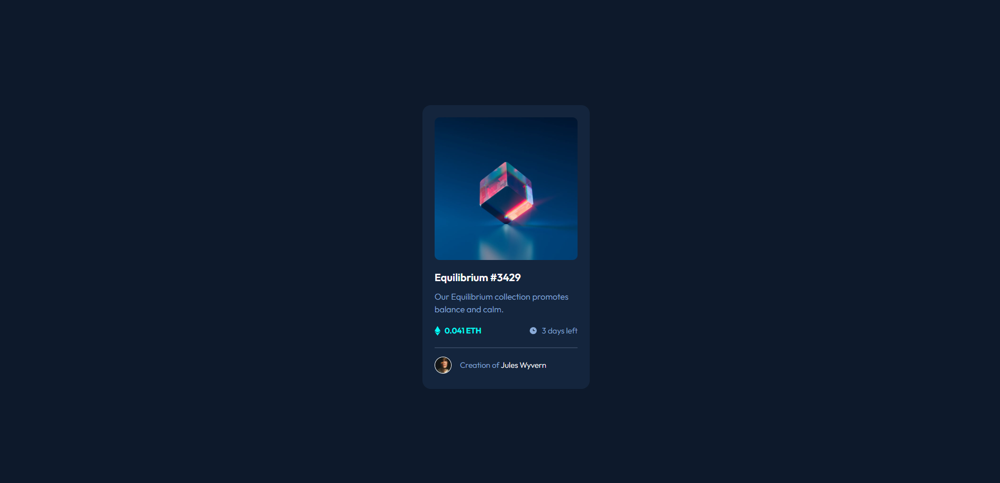

# Frontend Mentor - NFT preview card component solution

This is a solution to the [NFT preview card component challenge on Frontend Mentor](https://www.frontendmentor.io/challenges/nft-preview-card-component-SbdUL_w0U). Frontend Mentor challenges help you improve your coding skills by building realistic projects. 

## Table of contents

- [Overview](#overview)
  - [The challenge](#the-challenge)
  - [Screenshot](#screenshot)
  - [Links](#links)
- [My process](#my-process)
  - [Built with](#built-with)
  - [What I learned](#what-i-learned)
  - [Continued development](#continued-development)
- [Author](#NickTalvy)

## Overview

### The challenge

Users should be able to:

- View the optimal layout depending on their device's screen size
- See hover states for interactive elements

### Screenshot

### Links

- Solution URL: [My Code](https://github.com/NickTalvy/nft-preview-card-component-main)
- Live Site URL: [See It Live!](https://nicktalvy.github.io/nft-preview-card-component-main/)

## My process

### Built with

- Visual Studio Code
- Semantic HTML5 markup
- CSS custom properties
- Mobile-first workflow
- SASS/SCSS

### What I learned

My knowledge grew a little further with @media, which is somewhere I struggle. Also, first time using SASS/SCSS on my own. I obtained a better understanding for it. 

### Continued development

I am looking forward to getting more practice with SASS/SCSS and improving my organization. I love the idea behind it. Also, I think im getting the hang of utilizing @media to adjust for mobile->desktop. 

## Author

- Website - [My Github](https://github.com/NickTalvy)
- Frontend Mentor - [@NickTalvy](https://www.frontendmentor.io/profile/NickTalvy)